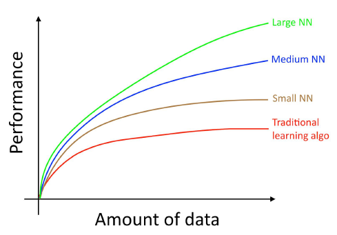

# Transfer Learning Approach to Train Models in Computer Vision Task

When training a CNN model, we may train it using an end-to-end or transfer learning approach. The former means the model’s weights are initialized from scratch. The latter means the model uses pre-trained weights. Transfer learning approach may boost the model's performance.

## How do we train a convolutional neural network model?

When we deal with computer vision (CV) tasks using deep learning techniques, especially convolutional neural networks (CNN or ConvNet), we can train our model using an end-to-end learning approach or transfer learning approach. An end-to-end learning approach means we initialize our model’s weights randomly or using certain initialization calculations such as xavier [1]. It is recognized that the performance of deep learning relies on the amount of training dataset [2]. The more data we have to train our model, the better the model will perform. As an example, the famous ImageNet has 14,197,122 images [3]. Besides we need a huge amount of dataset, we also need high computational resources. But we do not always have such abundant images for our CV task nor do we have enough computing resources. And also training models with small dataset tends to overfit to training dataset.

Image source: [4]

Another approach to train a deep learning model is transfer learning. Transfer learning means we use weights that are already trained from a certain image dataset (usually ImageNet) then apply those weights into our novel dataset or our new CV task. We can use transfer learning whether our new task is similar to the pre-trained domain or our new task is different from the pre-trained domain. We can use the pre-trained weights from ConvNet as explained well in [5], [6]:

1. ConvNet as feature extractor. Instead we use hand-engineered feature extractor, we use pre-trained ConvNet to extract features from our images. These features then run through a new classifier, which is trained from scratch.
2. Fine-tuning the ConvNet. Another approach is we can fine-tune the pre-trained weights to adapt with our new dataset by continuing the backpropagation. We can fine tune all layers of ConvNet or several layers only. Fine-tune is motivated by the observation that the earlier features of a ConvNet contain generic features (such as edge detectors), and later layers contain more specific features belonging to the dataset domain. Before we fine-tune our model, we have to train the new classifier on top of our ConvNet while freezing all ConvNet layers. Using this technique will boost our model performance [7].

There are several advices to use transfer learning technique [5]:
1. New dataset is small and similar to the original dataset: we only need to train the classifier part. Fine-tune is not a good idea due to overfitting concern.
2. New dataset is large and similar to the original dataset: we can try to fine tune the ConvNet layers.
3. New dataset is small and different from the original dataset. It is not recommended to fine-tune. Perhaps we can use several layers of ConvNet to extract features then train linear classifiers like SVM.
4. New dataset is large and different from the original dataset. We can train linear classifiers then fine-tune all layers of ConvNet or we can train a model from scratch.

# Transfer learning in medical image classification (diabetic retinopathy)

In this chance I will demonstrate image classification for medical image. The classification task is to classify diabetic retinopathy (eye diseases due to high sugar blood level) into 5 stages of diabetic retinopathy (DR). This is my ongoing thesis, so the result is not that good yet. But we still can see the advantage of using the transfer learning approach for the ConvNet model. I use the Keras framework to do this task. As mentioned in Keras documentation [8], Keras come along with several pre-trained models which are pre-trained on ImageNet. 

With Keras framework we have a simply straightforward pipeline to build models. First we have to decide our dataset and choose augmentation processes that will be applied to our dataset. Augmentation will help the model exposed with more data and generalize better. Second, we build our model architecture like VGG, Inception, Xception, or custom architecture along with its loss function, optimizer, and metrics. We can choose whether our model has pre-trained weights or not. In this case I choose Inception V3 architecture with pre-trained weights. Third, we can fit our model to the dataset, which means we train our model. We may add some callbacks functions, like model checkpoint, CSV logger, learning rate scheduler, etc to have some insight or control over the training process.

Training scheme:

1. Undersample train images into balance dataset (750 images from 5 classes)
2. Undersample test images into balance dataset (200 images from 5 classes)
3. Model will be trained using end-to-end learning approach
4. Model will be trained using transfer learning approach which is followed by fine-tune the model

The results are:

| Training method | Epoch | Learning rate | Accuracy |
|-|-|-|-|
| End-to-end learning | 100 | 1e-4 | 40% |
| Transfer learning | 30 | 1e-4 | 48% |
| Transfer learning + fine-tune | 70 | 2e-6 | 52% |

As we can see, through the transfer learning approach, we can boost our model’s performance compared to the end-to-end learning approach. Only in several epochs our transfer learning model has better accuracy over end-to-end learning model (accuracy 48% vs 40%). We can fine-tune the model to get even better performance (accuracy from 48% to 52%).

# References:

1. J. Guo, “AI Notes: Initializing neural networks,” deeplearning.ai. https://www.deeplearning.ai/ai-notes/initialization/ (accessed Oct. 13, 2020).
2. Y. Jiang, H. Wu, and J. Dong, “Automatic Screening of Diabetic Retinopathy Images with Convolution Neural Network Based on Caffe Framework,” in Proceedings of the 1st International Conference on Medical and Health Informatics 2017, Taichung City, Taiwan, May 2017, pp. 90–94, doi: 10.1145/3107514.3107523.
3.	“ImageNet.” http://image-net.org/about-stats (accessed Oct. 13, 2020).
4.	A. Ng, “Machine Learning Yearning-Draft,” p. 118.
5.	“CS231n Convolutional Neural Networks for Visual Recognition.” https://cs231n.github.io/convolutional-networks/ (accessed Apr. 27, 2020).
6.	F. Chollet, Deep learning with Python. Shelter Island, New York: Manning Publications Co, 2018.
7.	J. Yosinski, J. Clune, Y. Bengio, and H. Lipson, “How transferable are features in deep neural networks?,” ArXiv14111792 Cs, Nov. 2014, Accessed: Jun. 25, 2020. [Online]. Available: http://arxiv.org/abs/1411.1792.
8.	K. Team, “Keras documentation: Keras Applications.” https://keras.io/api/applications/ (accessed Oct. 14, 2020).

